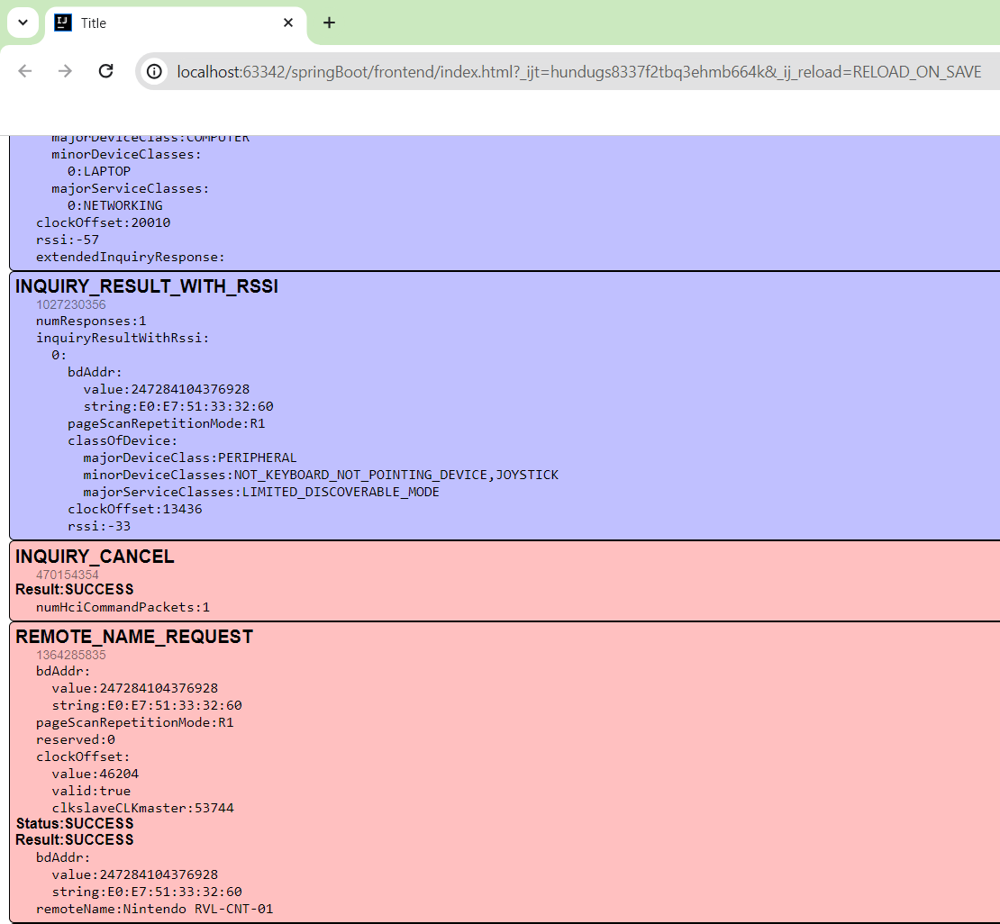

# HCI Explorer
Display details about HCI messages (commands, events and ACL data) captured by [wp81HCIFilter](https://github.com/fredericGette/wp81HCIFilter).

Requires a capture log file of HCI messages generated by [wp81HCIFilter](https://github.com/fredericGette/wp81HCIFilter)

## Usage
Install on a Lumia 520 Windows Phone 8.1 rooted with [WPinternals](https://github.com/ReneLergner/WPinternals) :
- [wp81HCIFilter](https://github.com/fredericGette/wp81HCIFilter) to capture HCI messages.
- [wp81DebugLogger](https://github.com/fredericGette/wp81DebugLogger) to log captured messages.
- [wp81Elevation](https://github.com/fredericGette/wp81Elevation) to stop the logger and allow access to the log file.
